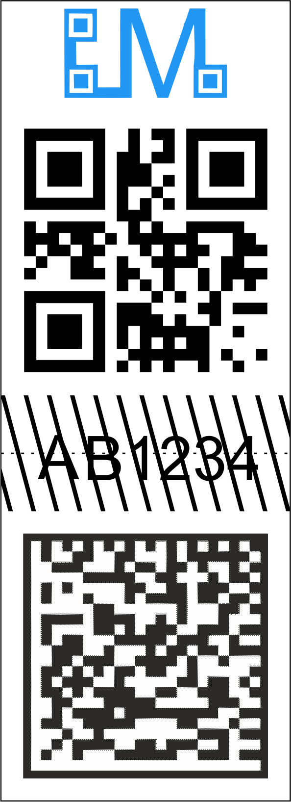
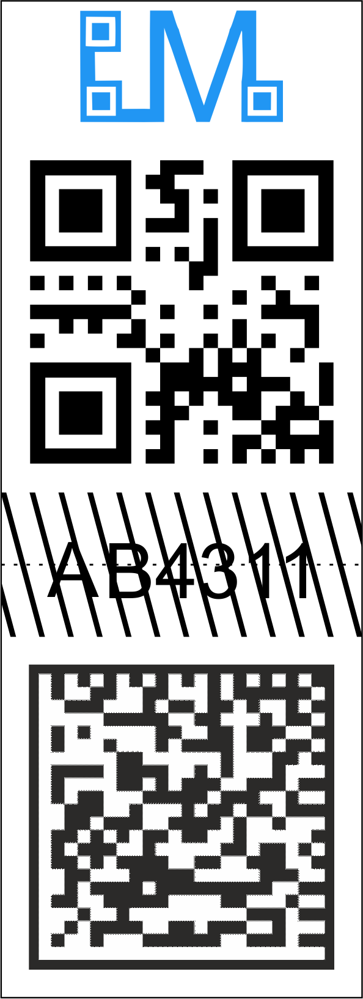

# LabelMaster1.0
Application to check if a label is genuine by checking QR and DM code.

QR code may have any information like a number (e.g. 1234...), REST API url (e.g. http://lab.me/1234) or any other information.

Datamatrix code has to have a cryptographic function of QR code information. In this initial case, MD5- 32 characters. 

After scanning both of them, the application shows if they are complient

For generating a database with numbers/urls and it's hashes, check other application https://github.com/PDymala/LabelMaster1.0-Desktop
That database has to be converted to 2D codes and printed with label software e.g. https://www.nicelabel.com/ , https://zebra.com or any other.

  
A sample label that is genuine:

  
A sample label that is counterfeit:

  
Code scanning thanks to https://github.com/yuriy-budiyev/code-scanner

