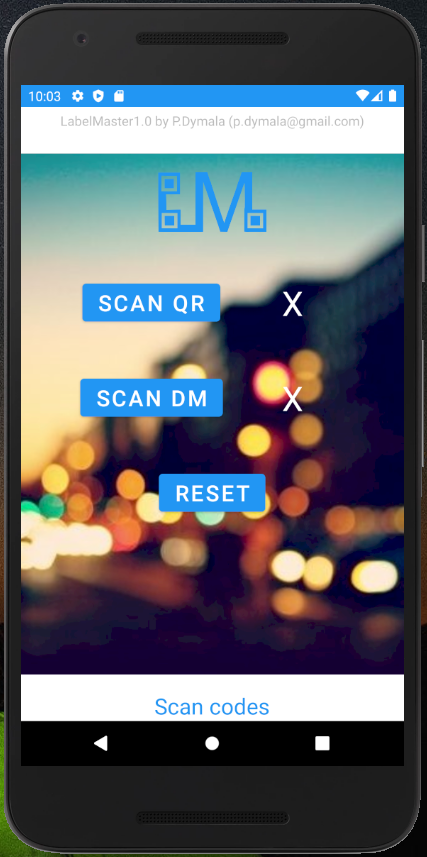
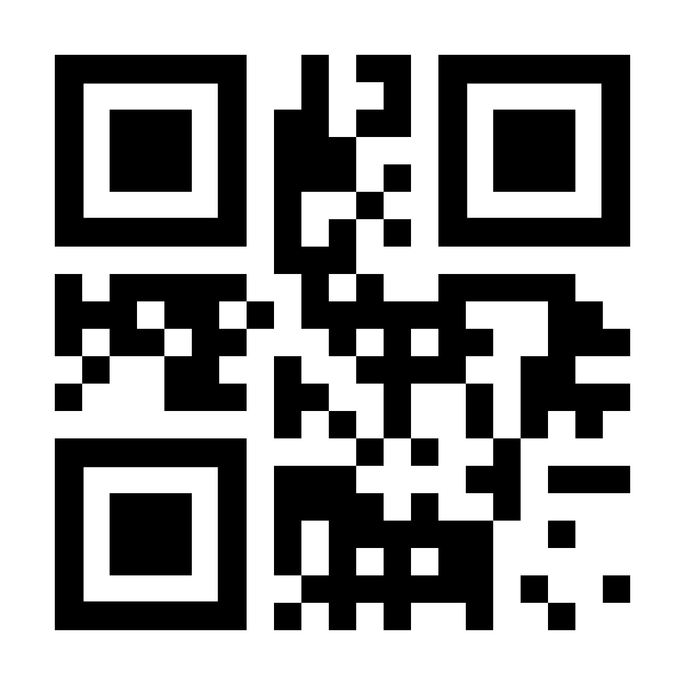
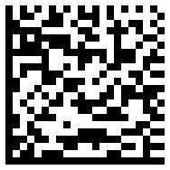

# LabelMaster1.0
Application to check if a label is genuine by checking QR and DM code.

QR code may have any information like a number (e.g. 1234...), REST API url (e.g. http://lab.me/1234) or any other information.

Datamatrix code has to have a cryptographic function of QR code information. In the initial case, MD5- 32 characters. 

After scanning both of them, the application shows if they are complient

For generating a database with numbers/urls and it's hashes, check other application ....

Sample two codes that are complient:

And a random dm code if you want to try an non complient code

Code scannig thanks to https://github.com/yuriy-budiyev/code-scanner

